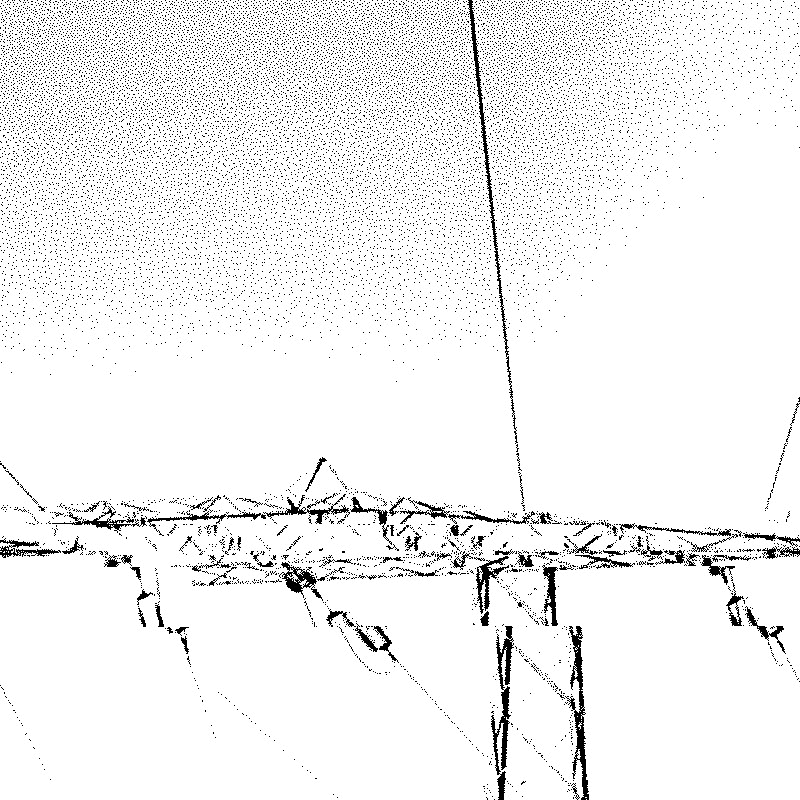
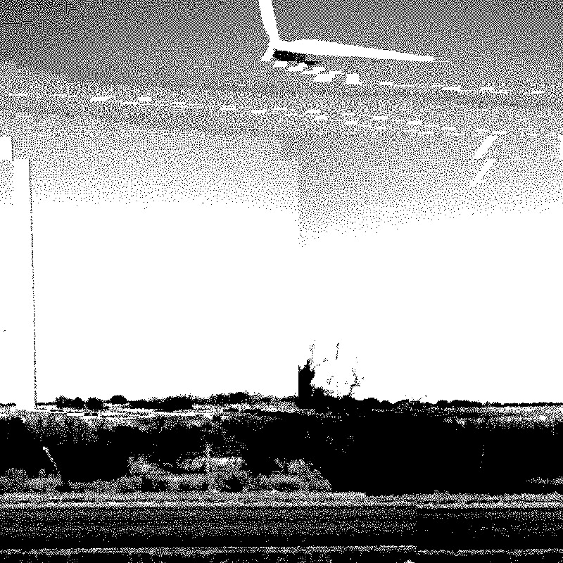

{:style="display:block; margin-left:auto; margin-right:auto"}{: width="350" }{: height="350" }

<h3> 
 Living in a simulation? Cybernetic promises and data challenges of digital twins to decarbonise energy systems 
 </h3> 

Decarbonising energy systems by 2050 presents multiple dilemmas between national security, affordability, public support, and health. What if we could model these dilemmas and better anticipate sociotechnical impacts of building a new nuclear station, installation of solar panels on every roofs, or a change in energy tariffs? Digital twins--advanced virtual representations of social and physical processes and objects--promise to achieve that. However, as digital twins are still in the ‘demonstrator’ stage, many questions arise with regards to data accuracy, security; required expertise, and, most importantly, the epistemic foundations of claims made by models, predictions and resulting policy recommendations. This project investigated the sites of knowledge production related to digital twins in the context of energy systems, asking the following questions:
<ul>
  <li>Cybernetic promises: Which futures are afforded through digital twins’ outputs? What do these futures exclude or assume?</li>
  <li>Data challenges: What are potential security and privacy risks associated with digital twins and how to manage them?</li>
</ul>

  
<strong>[Read more]</strong>

  

  
<strong>Main findings:</strong>

The analysis reveals that initially hype helped to enrol a broad community of stakeholders through the promises of detailed, real-time modelling, developed in tandem with responsible innovation tools for data scientists. Soon after, this framing brought about disappointment and confusion. With data access emerging as a key challenge, practitioners are re-aligning the agenda towards the creation of the infrastructure for data sharing. However, the debate on the ethics and politics of digital twins stayed with the initial framing of ‘digital twins-as-models’. In other words, the politics of data sharing were concealed. As such, digital twins require sociotechnical analysis beyond the modelling-specific concerns of bias, accuracy or explainability. Energy governance should focus instead on anticipating the reconfiguration of the political and economic relationships enabled by new data sharing infrastructures. Finally, we identify three governance concerns related to data sharing infrastructures in energy: 1) transparent procurement; 2) public engagement in grid upgrades; 3) sustainable financing of public IT projects.

   

  

  ***

 
<strong>Policy Recommendations:</strong>

   
  <ul>
  <li><strong>Recommendation 1</strong>DESNZ or Innovate UK to commission research charting of the interests, business models and powers of future software services: ‘companies are planting their flags. There are a few monopolies that are starting to being or be built or required for the energy system, and people want them because, well, it's a guaranteed return’ (interview quote). Within that, the energy industry ought to learn from the rich literature on theorising platform power dynamics through regulatory capture and empirical cases from other sectors.</li>
<li><<strong>Recommendation 2</strong>The National Digital Twin Programme and Alan Turing Digital Twin Network+ to launch interdisciplinary exchanges workshops on interoperability where energy practitioners, lawyers, economists, political researchers and computer scientists together discuss the implications of various architectures and metadata formats.</li>
<li><strong>Recommendation 3</strong>Ofgem to move beyond the pilot project as a default mode of R&D, focusing instead on mandating the upgrade of mundane legacy issues, like inconsistencies in data formats across DNOs.</li>
<li><strong>Recommendation 4</strong>Ofgem and Cabinet office to increase the transparency in public procurement of software to improve public trust in energy digitalisation and avoid controversies like the NHS procuring Palantir to process patient data. </li>
<li><strong>Recommendation 5</strong>Think tanks and NGOs (e.g. Regen, Citizen Advice Bureau) to revive debate about consumer privacy ahead of the creation of the consumer data consent mechanism. The framing should be a matter of advancing evidence-based deliberation rather than solely informing citizens.</li>
</ul>

  

  ***

<strong>Project team:</strong> Dr Ola Michalec (Fellow)

  

  ***

<strong>Outputs:</strong>

<ul>
  <li><strong>Peer-reviewed journal article:</strong> "Models vs infrastructures? On the role of digital twins’ hype in anticipating the governance of the UK energy industry”. In Environmental Science and Policy (Special Issue on twin transitions). 2025. By Michalec, O.. <a href="https://doi.org/10.1016/j.envsci.2025.104041">Full text</a></li>
  <li><strong>Webinar:</strong> "Developing digital twins in the energy industry". In Value in Energy Data, Energy Systems Catapult webinar. 2025. By Michalec, O.. <a href="https://www.youtube.com/watch?v=m7YmwzSdXxM&t=2144s&ab_channel=EnergySystemsCatapult">Full video</a></li>
</ul>

<!DOCTYPE html>
<html>
  <head>
   <title>Developing Digital Twin in the Energy Industry</title>
  </head>
  <body>
    <h1>Developing Digital Twin in the Energy Industry</h1>
<iframe width="560" height="315" src="https://www.youtube.com/embed/m7YmwzSdXxM?si=8A-K8rTlOR-fIygD" title="YouTube video player" frameborder="0" allow="accelerometer; autoplay; clipboard-write; encrypted-media; gyroscope; picture-in-picture; web-share" referrerpolicy="strict-origin-when-cross-origin" allowfullscreen></iframe>
  </body>
</html>

  

  

  {:style="display:block; margin-left:auto; margin-right:auto"}{: width="350" }{: height="350" }

  <h3> 
 Hype Studies Group 
 </h3> 

[Hype Studies](https://hypestudies.org/) is an emergent, transdisciplinary research area aimed to investigate hype as a powerful and pervasive phenomenon that influences economic trends, political agendas, media narratives, and technological developments. We are a group of researchers and designers exploring how hype is a thing that does things. As a force composing and affecting attention, markets, politics, feelings, imagination, matter and knowledge, time and space. The Hype Studies group will be sharing resources and organising events to collectively understand and intervene into hype and its politics.

Join us for the inaugural [conference](https://hypestudies.org/conference) at the Universitat Oberta de Catalunya 10-12th September 2025 (hybrid attendance available). We hope that the conference will attract researchers interested in how energy innovations suceed or fail. In the age of noise and careless promises, how can we better evaluate hype related to 'sustainable' technologies?

  

   
<strong>[Read more]</strong>

  

  
<strong>Conference:</strong>

  

  ***

  
<strong>Commissioned artwork</strong>

   

  

  ***

<strong>Project team:</strong> Andreu Belsunces Gonçalves, Wenzel Mehnert, Vassilis Galanos, Dani Shanley, Jascha Bareis, Pierre Depaz, Isa Luiten, Ola Michalec 

  

  ***

<strong>Outputs:</strong>

<ul>
  <li><strong>type:</strong> "referece". <a href="link">Full text</a></li>
</ul>

  

  

  
