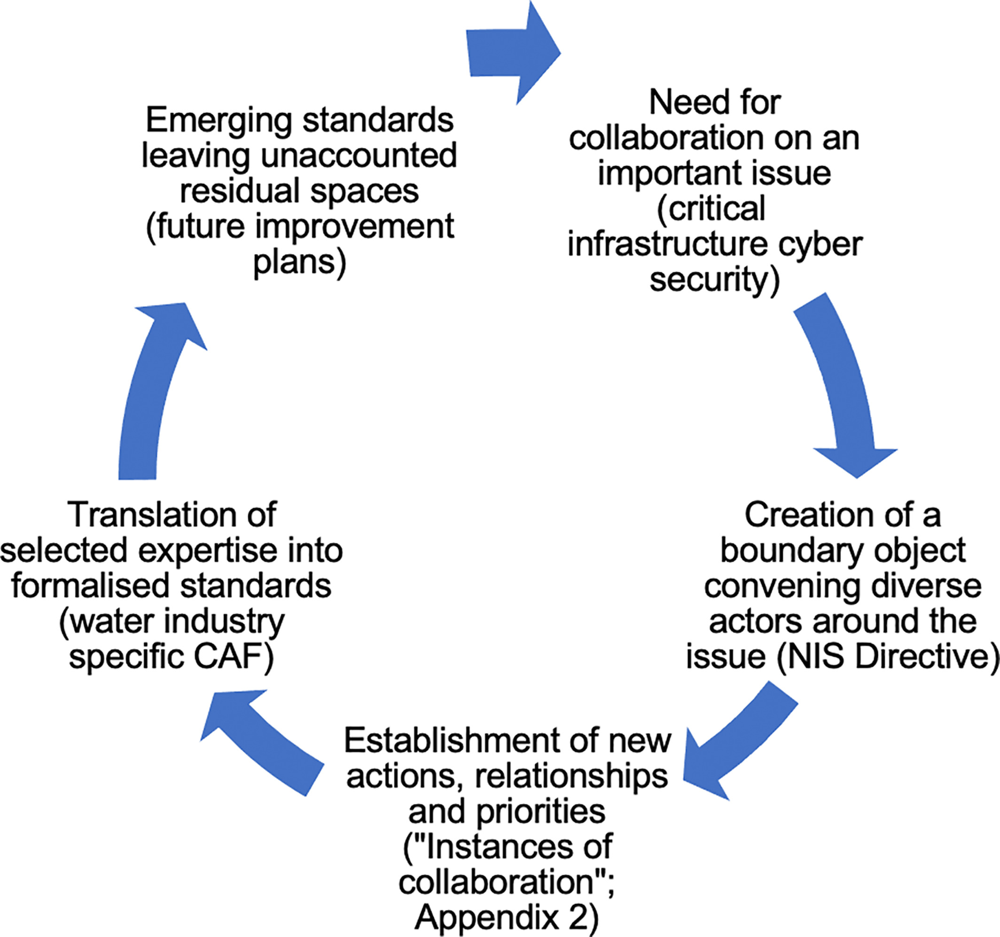
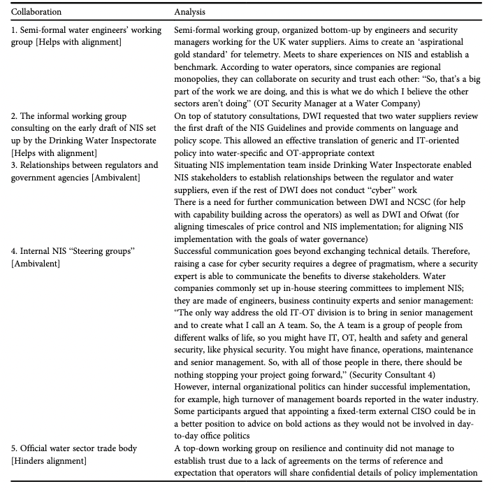
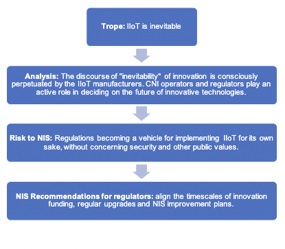
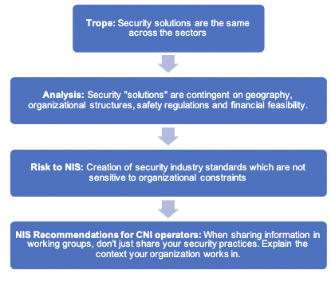
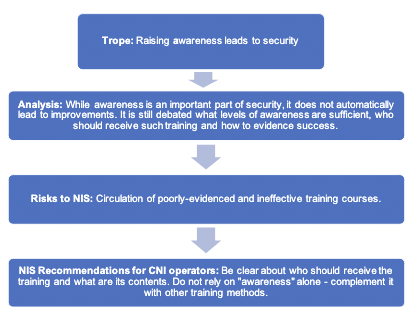

{:style="display:block; margin-left:auto; margin-right:auto"}{: width="350" }{: height="350" }

### How many shades of NIS? Understanding organisational cultures and sectoral differences during cyber security policy implementation

The project developed an empirically-grounded understanding of the role and impact of organisational cybersecurity cultures and practices across essential infrastructure sectors on the UK’s implementation of the Network and Information Systems (NIS) Regulations. We uncovered organisational and sectoral differences, for instance, in the ways which people work, what technologies (software/hardware) are relied upon, what additional compliance requirements exist. This yielded key insights about the NIS objectives that are already achieved, the ones difficult to effectively realise and potential blind spots arising from organisational cultures and sectoral practices. 

**Main Findings:**
* In ["When the future meets the past: can safety and cyber security coexist in modern critical infrastructures?"]((https://doi.org/10.1177/20539517221108369)), we argue that the implementation of Network and Information Systems Security Directive is the first step in the integration of safety and security through novel risk management practices. Therefore, it is the move towards legitimising the modernisation of critical infrastructures. But we also show that security risk management practices cannot be directly transplanted from the safety realm, as cyber security is grounded in anticipation of the future adversarial behaviours rather than the history of equipment failure rates.
* We present our argument in four parts. First, by establishing that safety-security integration was key for engineers accepting the modernisation agenda. Second, by outlining collective risk management practices that enabled diverse practitioners to collaborate (risk thinking hivemind, diversity in expertise, trust in collaborations). Third, by highlighting how practitioners borrowed elements from safety culture and incorporated it to security (harmonised threat and incident reporting, maintenance contracts). Fourth, by cautioning that epistemic and material differences between the old world of legacy technologies and novel big data tools pose limits to the future of critical infrastructures modernisation (namely, engineers trained to reason in prescriptive terms, secrecy in cyber, differing logics of risk assessment between safety and security professions).

* In ["Reconfiguring governance: How cyber security regulations are reconfiguring water governance"](https://doi.org/10.1111/rego.12423), we argue that the Network and Information Systems Regulations acts as a 'boundary object' that gathers diverse communities of practice, enabling collaboration without the need to establish common goals.

{:style="display:block; margin-left:auto; margin-right:auto"}{: width="350" }{: height="350" }
  
In the process of transposing the EU NIS Directive into the sectoral and national context, NIS requires interpretation by diverse expert communities. We show how translating the regulatory scope to the sectoral landscape involves prioritising some water governance goals over others. As expert communities converge in their collaboration practices, their priorities align or stand in tension with public interests. We argue that cyber security regulations have potential to reconfigure water governance by refocusing strategic priorities away from traditional concerns of environmental governance. 

{:style="display:block; margin-left:auto; margin-right:auto"}{: width="600" }{: height="600" }

{:style="display:block; margin-left:auto; margin-right:auto"}{: width="600" }{: height="600" }

We inquired into five instances of collaboration in the water industry cyber security landscape. We analysed whether they help or hinder with the alignment of NIS and public interest. 

{:style="display:block; margin-left:auto; margin-right:auto"}{: width="600" }{: height="600" }

* In ["Industry Responses to the European Directive on Security of Network and Information Systems (NIS): Understanding policy implementation practices across critical infrastructures"](https://www.usenix.org/conference/soups2020/presentation/michalec), we found that the emerging field of Operational Technology Security is yet to formulate its norms, standards and career trajectories.
* We identified a number of security tropes. We define them as widely held beliefs which require a further level of detail before they can be successfully applied to the OT context. Due to the combination of rhetorical qualities like generalisation, ambiguity and strong normativity, they lead to the creation of advice which can be easily marketed at mass scale. As they’re quite vague,
they can appeal to professionals from diverse backgrounds.

* The tropes identified are: 1) Separation means security; 2) IIoT is inevitable; 3) Security solutions are the same across the sectors; 4) Raising awareness leads to security.

{:style="display:block; margin-left:auto; margin-right:auto"}{: width="600" }{: height="600" }

{:style="display:block; margin-left:auto; margin-right:auto"}{: width="600" }{: height="600" }

{:style="display:block; margin-left:auto; margin-right:auto"}{: width="600" }{: height="600" }

{:style="display:block; margin-left:auto; margin-right:auto"}{: width="600" }{: height="600" }
  
* We presented a classification of cyber security practices mapping the diversity of policy interpretations: 1) Compliance; 2) Workaround; 3) Going above and beyond policy remit; 4) Negotiation. This classification questions a common assumption that infrastructure operators merely comply with regulations. In fact, they take a very active role in shaping NIS.

{:style="display:block; margin-left:auto; margin-right:auto"}{: width="600" }{: height="600" }

**Policy Recommendations:**
* Recommendation 1 (for CNIs operators deciding on improvement plans): Know about and protect yourselves against threats which circumvent air-gapped systems. Check whether alternatives to air-gapping comply with safety standards.

* Recommendation 2 (for regulatory bodies overseeing NIS): Align the timescales of innovation funding, regular upgrades and NIS improvement plans. When approving price reviews for network upgrades, seek robust evidence for the claims on the operational benefits of proposed innovations.

* Recommendation 3 (for CNI operators responsible for cyber security training): Tie the training to employees’ personal concerns to make it relatable and interesting. Do not rely on "awareness" alone - complement it with other training methods. Above all, place “awareness” in the usability context of daily work; i.e. plant supervisors have different concerns to admin staff.

* Recommendation 4 (for all stakeholders): Practitioners should pay continuous attention to the idea of “translation” across IT and OT as well as across the sectors to improve their capabilities of policy formulation and interpretation. This will ensure that the scope and latter auditing of NIS pertains both OT and IT and that the improvements are tailored to each system.

* Recommendation 5 (for all stakeholders): We recommend that security practitioners ought to improve their capabilities in the areas of human and social factors of technology, so they while implementing NIS, they do not compromise on other public values such as privacy, sustainability or equity.

* Recommendation 6: The bottom-up involvement of experts in Operational Technologies, Safety Engineering and Environmental Politics experts is key to ensure a NIS implementation is inclusive of water governance issues.

* Recommendation 7: Security experts in Operational Technologies ought to train themselves to better communicate business benefits of security measures.

* Recommendation 8: We encourage the formation of sector-specific informal working groups for sharing information about NIS implementation, security maturity and evolving threats. Such groups ought to have clear terms of reference and scope to enable trustworthy information sharing.

* Recommendation 9: Following the translation of high-level NIS Directive into sector-specific assessments, regulators should reflect on residual spaces left unaccounted for by the emerging standard.

**Project team:** Prof. Awais Rashid (PI), Dr Dirk van der Linden (Co-I), Dr Sveta Milyaeva (Co-I), Dr Ola Michalec (PDRA). We were funded by the Research Institute in Trustworthy Inter-connected Cyber-Physical Systems (RITICS).

**Outputs:**

* **Journal article:** "When the future meets the past: can safety and cyber security coexist in modern critical infrastructures?". 2022. By Michalec, O., Milyaeva, S. and Rashid, A. In: Big Data and Society. [Full text](https://doi.org/10.1177/20539517221108369)

* **Journal article:** "Reconfiguring governance: How cyber security regulations are reconfiguring water governance". 2022. By Michalec, O., Milyaeva, S. and Rashid, A. In: Regulation and Governance. [Full text](https://doi.org/10.1111/rego.12423)

* **Journal article:**  "Industry Responses to the European Directive on Security of Network and Information Systems (NIS): Understanding policy implementation practices across critical infrastructures". 2022. By: Michalec, O., van der Linden, D., Milyaeva, S. and Rashid, A. In: Symposium on Usable Privacy and Security. [Full text](https://www.usenix.org/conference/soups2020/presentation/michalec)

{:style="display:block; margin-left:auto; margin-right:auto"}{: width="350" }{: height="350" }

### What’s next for the NIS Directive? Extending the community of interest to better understand the Indicators of Good Practice

Since 2018, the European Union member states and the UK have been working on implementing the Network and Information Systems Security (NIS) Directive. The literature analysing the framing of NIS (e.g. [Michels and Walden, 2018](https://papers.ssrn.com/sol3/papers.cfm?abstract_id=3297470), and [Wallis and Johnson, 2020](https://ieeexplore.ieee.org/abstract/document/9139641)) points at two main policy concerns: (i) the operators will fail to share or disclose information about cybersecurity measures and breaches and, as a result,  (ii) we will lack the understanding of co-dependencies (i.e., how security issues impact other areas of business). Our recent work through RITICS on NIS implementation (Michalec et al., [2020](https://www.usenix.org/conference/soups2020/presentation/michalec) and [2022(https://journals.sagepub.com/doi/full/10.1177/20539517221108369)) confirmed that both the goals of NIS and OT security issues are poorly understood outside of the narrow circle of experts. In particular, the Indicators of Good Practice (IGP) need further refining to better illustrate the progress in maturity.

This project contributed towards build a community of both cyber security experts and business leaders to enable translation between security and operational concerns and, as a result, make better decisions about cyber security in its broader organisational context. 

**Main Findings:**
* The NIS Regulations introduced the document called Cyber Assessment Framework (CAF). It is designed as a guidance outlining desired outcomes of good cyber security practices that facilitate independent risk management among the Operators of Essential Services.

* However, our research found a paradox regarding the use of CAF. Despite being designed to guide independent risk assessment and discourage ‘box ticking’, in some cases, CAF has been used as a prescriptive document, outlining exactly what needs to be achieved for compliance. This was justified with poor understanding of industrial assets and associated security risks across the Operators. We argue that outcome-based regulations are more likely to be successful once the stakeholders identify and apply a set of baseline security improvements. Such improvements ought to be benchmarked across the sector, linked to the traditional requirement of safety, and culturally accepted by Operational Technology engineers. (image here)

**Policy Recommendations for Competent Authorities:**
* Recommendation 1: Encourage voluntary sector-wide initiatives to benchmark responses to the NIS Regulations;

* Recommendation 2: Provide reassurance and remove stigma from reporting incidents and vulnerabilities;

* Recommendation 3: Highlight the overlaps between the NIS Regulations and commonly accepted sector-specific safety guidelines and standards;

* Recommendation 4: Be cognizant of the cultural differences between safety and security which limit the potential for harmonisation, i.e. prescriptive thinking of safety engineers or secrecy of security practitioners;

* Recommendation 5: Clarify communications about the aims of Cyber Assessment Framework, i.e., specify whether the document serves the purpose of compliance or independent risk assessment.

**Project team:** Dr Ola Michalec (Fellow)

**Outputs:**
* **Report:** "Resolving Anti-Patterns in Industrial Control Systems Environments". 2023. Contribution to the Report by the National Cyber Security Centre Industrial Control Systems Community of Interest. [Full text](https://ritics.org/wp-content/uploads/2023/10/ICS-COI-Resolving-Anti-Patterns.pdf)

* **Report:** "What’s next for the NIS Regulations? Findings from the RITICS Fellowship". 2023. Michalec, O.  [Full text](https://ritics.org/wp-content/uploads/2023/06/Whats-next-for-NIS-RITICS-report-final-310123.pdf)

